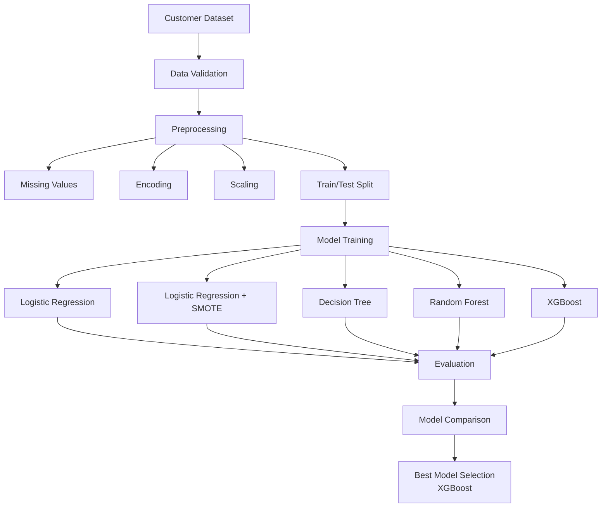

# Customer Churn Prediction System

Built an end-to-end machine learning pipeline to predict customer churn and compare multiple classification approaches on an imbalanced dataset.

The project focuses on:

- Churn prediction
- Class imbalance handling
- Model comparison
- Precision–Recall tradeoffs
- Business-oriented evaluation metrics

Goal:

Identify customers likely to churn while minimizing false predictions and maximizing actionable business insights.

# Architecture


## Dataset

Telecom customer churn dataset.

Target Variable:
- Churn (Yes/No)

Challenges:

- Significant class imbalance
- Mixed numerical and categorical features
- Business cost of false negatives

## Experiments

The objective was to maximize churn detection performance while maintaining a balance between precision and recall.

### Model Performance Comparison

| Model | Precision | Recall | ROC-AUC | F1 Score |
|---------|---------:|---------:|---------:|---------:|
| Logistic Regression | 0.237 | 0.928 | 0.816 | 0.378 |
| Logistic Regression + SMOTE | 0.250 | 0.907 | 0.811 | 0.392 |
| Decision Tree | 0.611 | 0.680 | 0.767 | 0.644 |
| Random Forest | 0.617 | 0.814 | 0.892 | 0.702 |
| XGBoost | **0.752** | 0.784 | **0.901** | **0.768** |


## Experimental Findings

### 1. Logistic Regression

Very high recall (92.8%) but extremely poor precision.

Pros:
- Rarely misses churners

Cons:
- Large number of false alarms

### 2. SMOTE

Improved precision slightly.

However:
- Minimal improvement overall
- Did not significantly improve ROC-AUC

### 3. Random Forest

Major performance jump.

- ROC-AUC increased to 0.892
- F1 increased to 0.702

### 4. XGBoost

Best overall model.

- Highest ROC-AUC
- Highest F1 Score
- Best precision-recall balance


## Failure Analysis

### False Positives

Customers predicted to churn but remained active.

Possible reasons:

- Temporary reduction in usage
- Seasonal behavior
- Insufficient behavioral features

### False Negatives

Customers predicted to stay but churned.

Possible reasons:

- External factors not present in dataset
- Competitor promotions
- Customer satisfaction issues not captured

### Class Imbalance Challenge

Initial models favored the majority class.

SMOTE was evaluated to mitigate imbalance but provided only marginal improvements.

### Model Tradeoff

Logistic Regression maximized recall but produced excessive false positives.

XGBoost achieved a more balanced business outcome.

## Best Model: XGBoost

Performance:

- Precision: 75.2%
- Recall: 78.4%
- ROC-AUC: 90.1%
- F1 Score: 76.8%

Confusion Matrix:

True Negatives: 545
False Positives: 25

False Negatives: 21
True Positives: 76


## Evaluation Methodology

Metrics Used:

- Precision
- Recall
- F1 Score
- ROC-AUC
- PR-AUC

Reason:

Accuracy alone is insufficient for imbalanced churn datasets.

Business impact is better reflected through precision-recall metrics.

## 🏆 Benchmark Summary

| Rank | Model | Precision | Recall | ROC-AUC | F1 Score |
|------|--------|---------:|---------:|---------:|---------:|
| 🥇 | XGBoost | **0.752** | 0.784 | **0.901** | **0.768** |
| 🥈 | Random Forest | 0.617 | **0.814** | 0.892 | 0.702 |
| 🥉 | Decision Tree | 0.611 | 0.680 | 0.767 | 0.644 |
| 4 | Logistic Regression + SMOTE | 0.250 | 0.907 | 0.811 | 0.392 |
| 5 | Logistic Regression | 0.237 | **0.928** | 0.816 | 0.378 |

**Selected Model:** XGBoost  
**Selection Criterion:** Highest F1 Score and ROC-AUC with a strong balance between precision and recall.

## 📁 Project Structure

```text
├── artifacts/                  # Operational Data & Model Artifact Checkpoints
│   ├── raw.csv                 # Original source data loaded by the ingestion component
│   ├── train.csv               # Data split optimized for feeding the model algorithms
│   ├── test.csv                # Data split reserved for model evaluation and metrics
│   ├── preprocessor.pkl        # Serialized pipeline handling encoding and standard scaling
│   └── model.pkl               # Frozen, high-performance champion XGBoost model weights
│
├── notebook/                   # Research & Exploratory Analysis Environment
│   ├── data/
│   │   └── Telecom_churn.csv   # Absolute raw starting data matrix
│   ├── EDA.ipynb               # Analysis mapping data imbalances and key features
│   └── model training.ipynb    # Algorithm benchmarking arena (XGBoost, RF, LR, SMOTE)
│
├── src/                        # Modular Production Execution Package
│   ├── components/             # Core Functional Execution Modules
│   │   ├── __init__.py         # Defines folder as an importable sub-package
│   │   ├── data_ingestion.py   # Pulls raw datasets and manages train/test matrix splits
│   │   ├── data_transformation.py # Constructs engineering pipelines and object serializations
│   │   └── model_trainer.py    # Tunes parameters, selects champion model, maps metrics
│   │
│   ├── pipeline/               # Workflow Processing Pipelines
│   │   ├── __init__.py         # Defines folder as an importable sub-package
│   │   ├── train_pipeline.py   # Step controller sequencing: Ingest -> Transform -> Train
│   │   └── predict_pipeline.py # Production connector feeding incoming values to frozen artifacts
│   │
│   ├── __init__.py             # Transforms src into an entry-point python package
│   ├── exception.py            # Global custom handler tracking code line errors and crashes
│   ├── logger.py               # Generates timestamped diagnostic logs for system tracking
│   └── utils.py                # Houses central binary loading and saving object helper logic
│
├── .dockerignore               # Blocks bulky development assets from cluttering Docker images
├── .gitignore                  # Prevents system junk, cached data, and virtual envs from pushing to git
├── Dockerfile                  # Sequential system build commands to bundle your application
├── Docker-compose.yml          # Port orchestration interface defining running network containers
├── LICENSE                     # MIT Open Source usage policy distribution permissions
├── app.py                      # Production web server interface serving predictive API routing
├── main.py                     # Root command execution entry point to trigger system runs
├── requirements.txt            # Document tracking specific third-party library installations
└── setup.py                    # Metadata build module compiling your source package

```

## 🛠️ Tech Stack

| Layer | Technology |
| :--- | :--- |
| **Model Engine** | XGBoost, Random Forest, Scikit-Learn |
| **Imbalance Handling** | SMOTE (Imbalanced-Learn) |
| **Core Utilities** | Custom Logging & Production Exception Handlers |
| **Web App Framework**| Flask / Streamlit |
| **Containerization** | Docker, Docker-Compose |

---

## 🚀 Run Locally

### 📋 Prerequisites
Make sure you have **Docker** and **Python 3.8+** installed on your machine.

### 1. Clone the Repository
```bash
git clone [https://github.com/BatthulaVinay/End-to-End-Machine-Learning-Churn-Prediction.git](https://github.com/BatthulaVinay/End-to-End-Machine-Learning-Churn-Prediction.git)
cd End-to-End-Machine-Learning-Churn-Prediction
