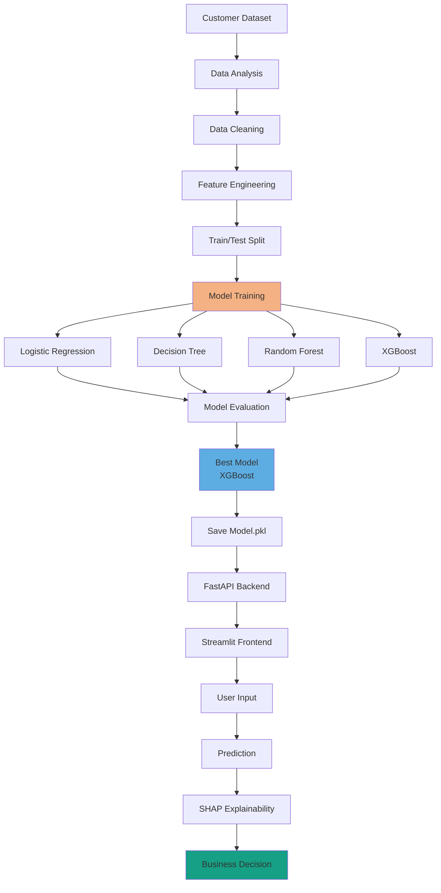

## 📊 Customer Churn Prediction 

[View Live Hugging Space](https://huggingface.co/spaces/BatthulaVinay/customer-churn-prediction)
<!-- Badges Section -->

  
  
  
  
  

Built an end-to-end machine learning system that predicts customer churn using XGBoost, served through FastAPI and deployed with Docker on Hugging Face Spaces. The system includes data preprocessing, feature engineering, SHAP-based model explainability, REST API inference, and an interactive Streamlit dashboard for real-time predictions.

## 🛠️ Tech Stack

Tech Stack

- Python
- Pandas
- NumPy
- Scikit-learn
- XGBoost
- SHAP
- FastAPI
- Streamlit
- Docker
- Hugging Face Spaces
- Git

## Demo Screenshots

 
 
 
 

## ✨ Features

- Data Analysis: Visualized churn drivers using correlation heatmaps.
- Model Explainability: Used SHAP for transparent prediction insights.
- FastAPI Backend: Served low-latency, real-time model predictions.
- Docker Ready: Fully containerized for consistent deployment.
- Live Demo: Hosted and accessible via Hugging Face Spaces.

## 📊 Model Performance Comparison

| Model | Precision | Recall | ROC-AUC | F1-Score | PR-AUC |
| :--- | :---: | :---: | :---: | :---: | :---: |
| **XGBoost** | **0.752** | 0.784 | **0.901** | **0.768** | **0.824** |
| Random Forest | 0.617 | 0.814 | 0.892 | 0.702 | 0.774 |
| Decision Tree | 0.611 | 0.680 | 0.767 | 0.644 | 0.566 |
| LR + SMOTE | 0.250 | 0.907 | 0.811 | 0.392 | 0.421 |
| Standard LR | 0.237 | **0.928** | 0.816 | 0.378 | 0.421 |

## 📈 Model Performance Improvement

| Model | F1-Score | Improvement |
| :--- | :---: | :--- |
| **Standard LR** (Baseline) | 0.378 | - |
| **XGBoost** (Best) | 0.768 | **+103.17%** |

## 🏗️ Architecture Diagram

### 🏗️ System Architecture

```mermaid
graph TD

    A[Customer Dataset]

    A --> B[Data Analysis]
    B --> C[Data Cleaning]
    C --> D[Feature Engineering]
    D --> E[Train/Test Split]

    E --> F[Model Training]

    F --> G[Logistic Regression]
    F --> H[Decision Tree]
    F --> I[Random Forest]
    F --> J[XGBoost]

    G --> K[Model Evaluation]
    H --> K
    I --> K
    J --> K

    K --> L[Best Model<br/>XGBoost]

    L --> M[Save Model.pkl]

    M --> N[FastAPI Backend]

    N --> O[Streamlit Frontend]

    O --> P[User Input]

    P --> Q[Prediction]

    Q --> R[SHAP Explainability]

    R --> S[Business Decision]

    style F fill:#F4B183
    style L fill:#5DADE2
    style S fill:#16A085
```

