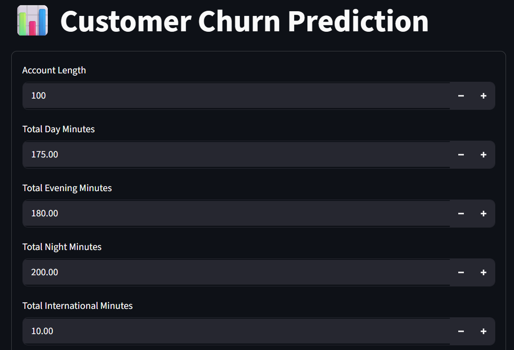
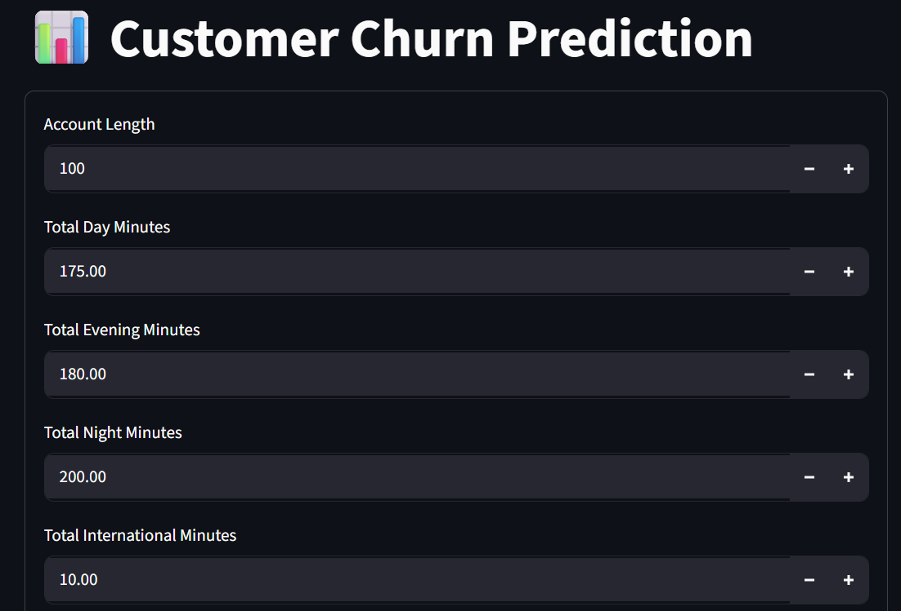
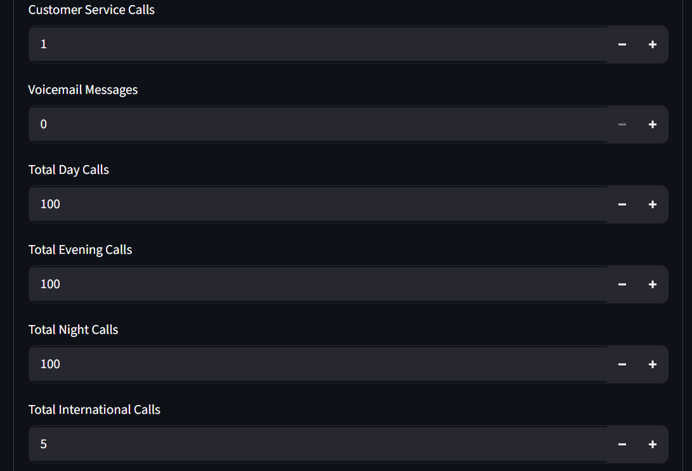
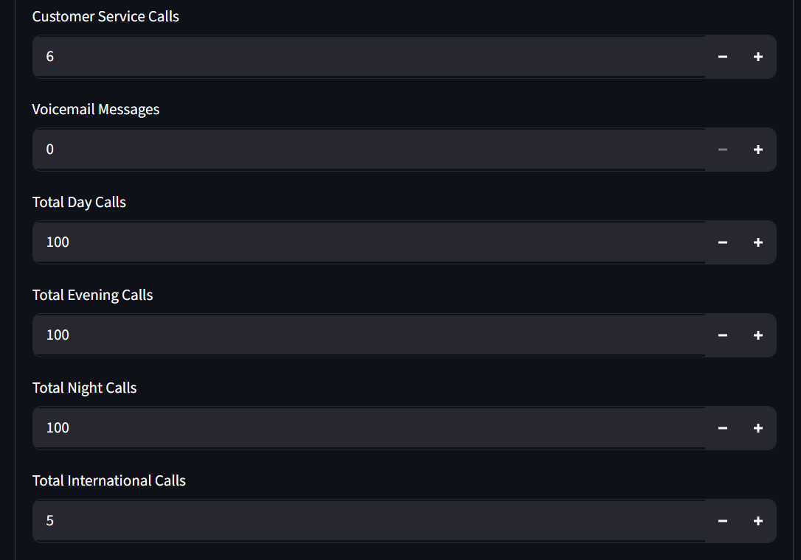
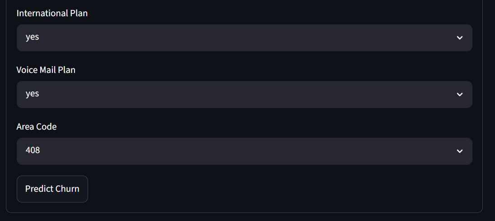
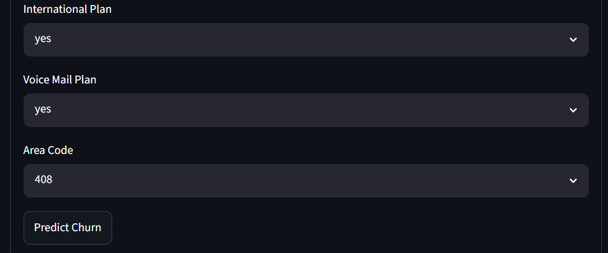
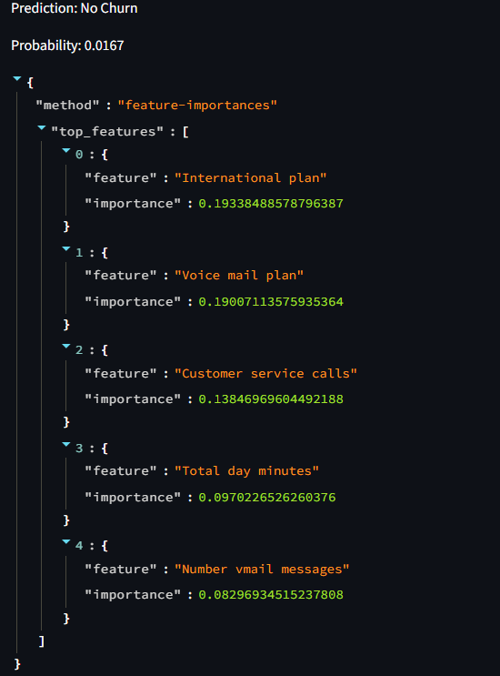
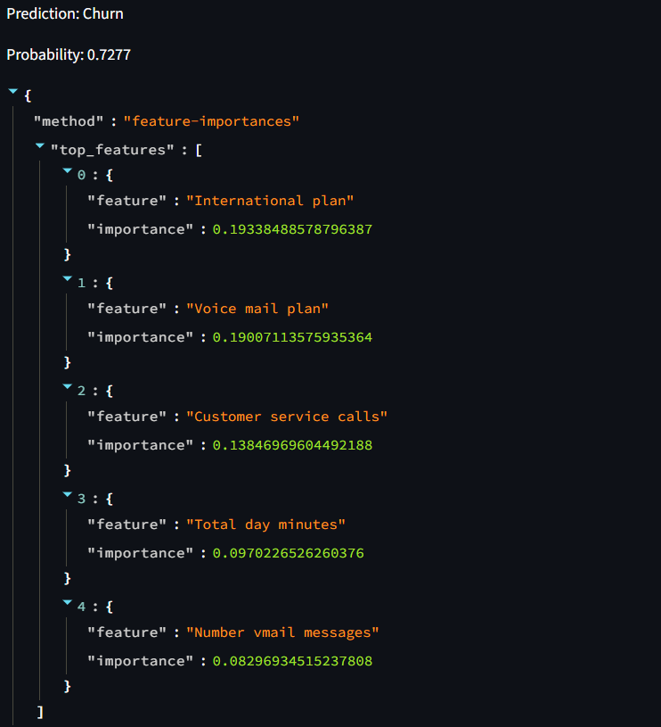
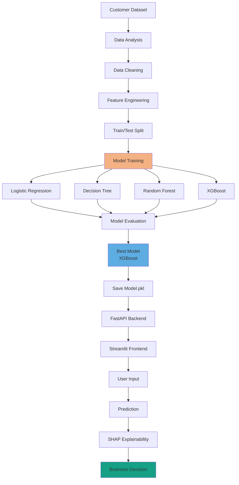

## 📊 Customer Churn Prediction 

[View Live Hugging Space](https://huggingface.co/spaces/BatthulaVinay/customer-churn-prediction)
<!-- Badges Section -->
<p align="left">
  <a href="https://huggingface.co/spaces/BatthulaVinay/customer-churn-prediction">
    
  </a>
  <a href="https://www.python.org/">
    
  </a>
  <a href="https://www.docker.com/">
    
  </a>
  <a href="https://fastapi.tiangolo.com/">
    
  </a>
  <a href="https://streamlit.io/">
    
  </a>
  <a href="https://huggingface.co/spaces/BatthulaVinay/customer-churn-prediction">
  
</a>
</p>

Built an end-to-end machine learning system that predicts customer churn using XGBoost, served through FastAPI and deployed with Docker on Hugging Face Spaces. The system includes data preprocessing, feature engineering, SHAP-based model explainability, REST API inference, and an interactive Streamlit dashboard for real-time predictions.

## 🛠️ Tech Stack

| Category | Technologies |
|----------|--------------|
| **Programming Language** | Python |
| **Data Analysis** | Pandas, NumPy |
| **Data Visualization** | Matplotlib, Seaborn |
| **Machine Learning** | Scikit-learn, XGBoost |
| **Backend API** | FastAPI |
| **Frontend** | Streamlit |
| **Deployment** | Docker, Hugging Face Spaces |
| **Version Control** | Git, GitHub |

## Demo Screenshots

 
 
 
 

## 🚀 Key Engineering Features

- **End-to-End ML Pipeline:** Built a complete machine learning workflow, including data preprocessing, feature engineering, model training, evaluation, and inference.
- **Model Benchmarking:** Compared multiple classification algorithms (Logistic Regression, Decision Tree, Random Forest, and XGBoost) to identify the best-performing model.
- **Explainable AI:** Integrated SHAP to provide both global and local feature importance, improving model transparency and interpretability.
- **REST API Serving:** Developed a FastAPI backend to deliver low-latency, real-time prediction through RESTful endpoints.
- **Interactive Web Interface:** Created a Streamlit application that enables users to submit customer information and receive instant churn predictions.
- **Containerized Deployment:** Dockerized the application to ensure consistent development, testing, and deployment across environments.
- **Cloud Deployment:** Deployed the complete application on Hugging Face Spaces for public access and demonstration.
- **Performance Evaluation:** Evaluated models using Precision, Recall, F1-Score, ROC-AUC, and PR-AUC to ensure robust model selection.
- **Reproducible Workflow:** Structured the project with modular components, making it easy to maintain, extend, and reproduce.

## ⭐ Project Highlights

- 🚀 Developed an end-to-end customer churn prediction system using **XGBoost**, achieving a **ROC-AUC of 0.901**.
- 📊 Benchmarked **five classification models** to identify the best-performing solution.
- 📈 Improved the **F1-Score by 103.17%** compared to the baseline Logistic Regression model.
- 🔍 Integrated **SHAP Explainability** to provide transparent and interpretable predictions.
- ⚡ Built a **FastAPI REST API** for real-time inference with low-latency responses.
- 🖥️ Developed an interactive **Streamlit** web application for user-friendly predictions.
- 🐳 Containerized the application using **Docker** for consistent deployment across environments.
- ☁️ Deployed the complete application on **Hugging Face Spaces** for public access.

## 📊 Dataset Overview

The project uses a **telecommunications customer churn dataset** to predict whether a customer is likely to discontinue the service.

| Attribute | Details |
|-----------|---------|
| **Domain** | Telecommunications |
| **Total Records** | 3,333 customers |
| **Total Features** | 19 input features + 1 target column |
| **Target Variable** | `Churn` (Binary Classification: True / False) |
| **Dataset Type** | Structured Tabular Data |

### Key Features

The dataset contains customer demographics, subscription details, service usage, and customer support interactions, including:

- State
- Account Length
- Area Code
- International Plan
- Voice Mail Plan
- Number of Voice Mail Messages
- Total Day Minutes, Calls, and Charges
- Total Evening Minutes, Calls, and Charges
- Total Night Minutes, Calls, and Charges
- Total International Minutes, Calls, and Charges
- Customer Service Calls

### Prediction Target

The objective is to predict whether a customer will **churn** (leave the telecom service) based on historical usage patterns and account information.

- **False** → Customer is retained
- **True** → Customer is likely to churn
  
## 📊 Model Performance Comparison

| Model | Precision | Recall | ROC-AUC | F1-Score | PR-AUC |
| :--- | :---: | :---: | :---: | :---: | :---: |
| **XGBoost** | **0.752** | 0.784 | **0.901** | **0.768** | **0.824** |
| Random Forest | 0.617 | 0.814 | 0.892 | 0.702 | 0.774 |
| Decision Tree | 0.611 | 0.680 | 0.767 | 0.644 | 0.566 |
| LR + SMOTE | 0.250 | 0.907 | 0.811 | 0.392 | 0.421 |
| Standard LR | 0.237 | **0.928** | 0.816 | 0.378 | 0.421 |

## 📈 Model Performance Improvement

| Model | F1-Score | Improvement |
| :--- | :---: | :--- |
| **Standard LR** (Baseline) | 0.378 | - |
| **XGBoost** (Best) | 0.768 | **+103.17%** |

## 🏆 Why XGBoost?

- Highest ROC-AUC

- Best Precision-Recall balance

- Highest F1 Score

- Better handling of nonlinear relationships

- Reduced overfitting through boosting

## 🏗️ System Architecture


```mermaid
graph TD

    A[Customer Dataset]

    A --> B[Data Analysis]
    B --> C[Data Cleaning]
    C --> D[Feature Engineering]
    D --> E[Train/Test Split]

    E --> F[Model Training]

    F --> G[Logistic Regression]
    F --> H[Decision Tree]
    F --> I[Random Forest]
    F --> J[XGBoost]

    G --> K[Model Evaluation]
    H --> K
    I --> K
    J --> K

    K --> L[Best Model<br/>XGBoost]

    L --> M[Save Model.pkl]

    M --> N[FastAPI Backend]

    N --> O[Streamlit Frontend]

    O --> P[User Input]

    P --> Q[Prediction]

    Q --> R[SHAP Explainability]

    R --> S[Business Decision]

    style F fill:#F4B183
    style L fill:#5DADE2
    style S fill:#16A085
```

## 🔍 Model Explainability

The system includes built-in explainability methods to improve model transparency and support business decision-making.

### Local Explanations

For individual predictions, the system identifies the most influential features contributing to churn predictions.

Depending on the model type:

- **Linear Models:** Uses feature coefficients to calculate contributions.
- **Tree-Based Models:** Uses feature importance scores.
- **Top Feature Ranking:** Displays the most impactful features for each prediction.

### Global Explanations

The project uses **Permutation Importance** to measure the impact of each feature on overall model performance.

This approach:

- Measures feature importance based on performance degradation.
- Is model-agnostic and works across different algorithms.
- Helps identify the strongest drivers of customer churn.

### Key Business Insights

Examples of important churn indicators include:

- Customer service calls
- International plan usage
- Total day minutes
- Account length
- Voice mail plan

## 🚀 Deployment Architecture

The application is deployed as an end-to-end machine learning system on **Hugging Face Spaces**, enabling users to submit customer information and receive real-time churn predictions through an interactive web interface.

### Deployment Flow

```text
User
   │
   ▼
Streamlit Frontend
   │
   ▼
FastAPI Backend
   │
   ▼
Preprocessing Pipeline
   │
   ▼
XGBoost Model
   │
   ▼
Prediction + Confidence Score
   │
   ▼
Display Results to User
```

### Deployment Components

| Component | Technology |
|-----------|------------|
| **Frontend** | Streamlit |
| **Backend API** | FastAPI |
| **ML Model** | XGBoost |
| **Containerization** | Docker |
| **Hosting** | Hugging Face Spaces |

🔗 **Live Demo:** https://huggingface.co/spaces/BatthulaVinay/customer-churn-prediction

## 📡 API Reference

The project exposes a REST API using **FastAPI** for real-time customer churn prediction.

### Base URL

```
http://localhost:8000
```

---

### Health Check

**GET /**

Checks whether the API is running.

#### Response

```json
{
  "status": "OK",
  "message": "Customer Churn API is running"
}
```

---

### Predict Customer Churn

**POST /predict**

Predicts whether a customer is likely to churn based on account usage and customer information.

#### Request Body

```json
{
  "account_length": 100,
  "total_day_minutes": 175.0,
  "total_eve_minutes": 180.0,
  "total_night_minutes": 200.0,
  "total_intl_minutes": 10.0,
  "customer_service_calls": 1,
  "number_vmail_messages": 0,
  "total_day_calls": 100,
  "total_eve_calls": 100,
  "total_night_calls": 100,
  "total_intl_calls": 5,
  "international_plan": "no",
  "voice_mail_plan": "yes",
  "area_code": 415
}
```

#### Response

```json
{
  "churn_prediction": 0,
  "churn_probability": 0.0831,
  "label": "No",
  "explanation": {
    "...": "Top SHAP feature contributions"
  }
}
```

---

### Response Fields

| Field | Description |
|--------|-------------|
| `churn_prediction` | Predicted class (`0 = No Churn`, `1 = Churn`) |
| `churn_probability` | Probability of customer churn |
| `label` | Human-readable prediction (`Yes` or `No`) |
| `explanation` | feature importance for the prediction |

## ⚙️ Installation

### 1. Clone the Repository

```bash
git clone https://github.com/BatthulaVinay/customer-churn-prediction.git
cd customer-churn-prediction
```

### 2. Create a Virtual Environment (Recommended)

**Windows**

```bash
python -m venv venv
venv\Scripts\activate
```

**Linux/macOS**

```bash
python3 -m venv venv
source venv/bin/activate
```

### 3. Install Dependencies

```bash
pip install -r requirements.txt
```

### 4. Run the FastAPI Server

```bash
uvicorn app:app --reload
```

The API will be available at:

```
http://localhost:8000
```

Interactive API documentation:

```
http://localhost:8000/docs
```

### 5. Run the Streamlit Application

```bash
streamlit run app.py
```

The web application will be available at:

```
http://localhost:8501
```

## ▶️ Running the Application

1. Start the FastAPI server.
2. Launch the Streamlit application.
3. Open the Streamlit URL in your browser.
4. Enter customer information.
5. Click **Predict Churn**.
6. View the prediction probability and explanation.
